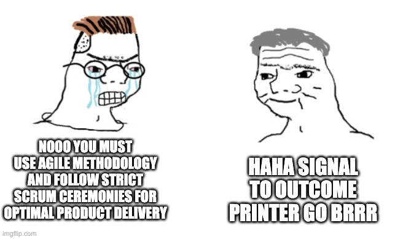

# What I Think I Think About the Future of Product Development

Where product craft is headed as AI collapses distance between roles

I strongly believe in the concept of strong opinions, weakly held. This is one of those strong opinions. The bottleneck in product development has shifted. For thirty years, the constraint was engineering capacity. Roadmaps and specs existed because we couldn't build fast enough. That's no longer true.

The barrier to building software is falling rapidly, and the bottleneck has shifted away from engineering and toward ingestion and go-to-market, toward finding signal. The question is no longer how fast can we build, it is how fast can we generate signal from the market that is worth acting on. Most organizations are still underestimating what this change actually means. Below are nine things I think I know about the new world of product development we find ourselves in.

## The Navy and the Special Missions Unit

The traditional product development model looks like a big blue navy. It takes years to design, build, test, and train. It is powerful, robust, and exacting, but it is not fast and it is not agile. Increasingly, it is not what the best product organizations look like.

The future looks more like a special missions unit. Small teams, fast timelines, precise outcomes, and clear reasoning. Teams that generate intelligence from the market, deploy against specific problems, execute quickly, debrief, and move to the next mission. Business and warfare are not the same, but the structural analogy holds.

This shift changes the role of the spec, the role of the product manager, the shape of the roadmap, and the interface between product, engineering, and go-to-market.

## Specs Are Shrinking

When building is cheap, speed of validation matters more than exhaustive planning. A one-pager is enough: who is the user, what problem are we solving, why does it matter, and what does winning look like. The prototype shows the what, the spec explains the why, and a short Loom ties them together as the new handoff artifact. The goal is not a multi-page document - it is just enough clarity to move.

I built a workflow called Team Room to operationalize this. Rough notes become structured mini-specs in seconds, enriched with prior customer signal and filled with clear placeholders. Not a legal document. Just enough to tell the story and move.

## Immediate Validation

This is not theoretical. During an embedded visit with a global financial institution, I was not sitting in a conference room giving a presentation. I was in the room where the work actually happens, watching how their team operated. A workflow gap surfaced mid-conversation - the kind of thing that never makes it into a survey response or a support ticket, because the people living with it have stopped noticing it.

Notes became a mini-spec. The spec became a clickable prototype. The customer interacted with it before the meeting ended and said yes, with one small tweak.

Engineering built the initial delivery in days.

What matters is not that it happened once. It is that it is now repeatable by design. The entire cycle - from a gap surfacing in conversation to a customer reacting to a prototype to a shipped delivery - has collapsed into something that fits inside a single sprint. The organizations figuring out how to run that cycle consistently are the ones pulling ahead. Everyone else is still writing the PRD for what they learned in last quarter's customer call.

## The PM Role Is Shifting From Writing to Listening

The role of a product manager has always involved listening. That is not new. What is new is where the primary output lives. It used to live in the spec. Increasingly, it lives in the signal. The best PMs build systems and relationships that continuously generate validated market intelligence at speed.

At TRM, I approach this through three programs. A Client Feedback Group of senior leaders where a single question - *What did you expect to see that you did not see?* - generates signal that becomes features within days or weeks. Embedded PM, where sitting on-site with customers long enough to understand their real workflows and real pressures is what shifts you from building for a generic persona to building for a specific person. And FI Firesides, small sessions across organizational levels that build empathy from the executive suite to the frontline analyst. Together these programs generate some of our most consequential signal. The PM's job is to build and maintain that flow.

## Feedback Loops Have Collapsed

The entire discipline of product management was built around the assumption of long feedback loops. You shipped something. You waited weeks or months for enough usage data to be meaningful. You ran a retrospective. You incorporated the learnings into the next planning cycle. Repeat every quarter.

That cadence is dissolving. When you can prototype in minutes and validate in the same conversation, you are no longer waiting for post-launch data to tell you if you were right. You are finding out before you build. The debrief happens before the sprint begins. This fundamentally changes how teams operate and learn.

It also raises the bar on judgment, because faster loops create more opportunities to be wrong faster. Speed does not replace discernment. It demands it.

## Compounding Interest

AI is turning fragmented tribal knowledge, scattered across notes, conversations, Slack threads, and customer visits, into a continuously improving system of record. And unlike the institutional knowledge of the past, which degraded every time someone left the company or a Confluence page went un-updated, this version compounds over time.

In Team Room, context is already there when you need it. You are not reconstructing knowledge; you are building on top of it. That is the most underrated form of leverage. Not AI writing your specs. Not AI generating your code. AI making your institutional memory usable at speed.

And today's tools are the least capable they will ever be.

## Rigid Roadmaps Are Giving Way to Missions

A fixed roadmap now carries the cost of all the signal it cannot see. The era of the six, twelve, or twenty-four month plan is fading, not because planning is bad, but because rigid planning has become expensive in a new way.

What is replacing it is a mission model. Go-to-market identifies a problem. Product translates it into a clear job to be done with a defined outcome. A small team builds, ships, debriefs, and moves to the next mission. The roadmap becomes a living backlog of validated signal that reprioritizes continuously. The work does not become less intentional in this model. If anything, it becomes more intentional, because every mission is anchored to a specific piece of validated signal rather than a planning cycle's best guess.

## The Product-Engineering Interface Is Getting Lighter

Product brings validated signal and a prototype that the customer has already reacted to. Engineering clarifies, collapses scope, builds, and ships. There is less negotiation and fewer meetings, and more focus on execution.

The prototype carries the customer's voice with it. Engineering is not evaluating a document written by a PM. Engineers are seeing something a real person has already touched and responded to. The conversation shifts from whether we should build this to how we build it correctly. That is a meaningfully different conversation.

## The Speed of Building Now Demands the Speed of Thinking

AI accelerates every part of the pipeline, not just engineering. If product operates at its old pace, faster engineering just produces the wrong things faster. The leverage is not in the tools alone, but in whether the people using them have updated their operating model to match.

I've tested this beyond TRM as well in building a personal security platform and an AI-powered travel briefing app. Both went from concept to interactive prototype in sessions that would have previously required weeks and a full team. The constraint in both cases was never building the tool; it was clarity of thought to know what to build, why it matters, who it is for, and what winning looks like. That clarity is still entirely human. AI has removed almost everything else.

AI is not a productivity tool for product teams. It is an operating model upgrade. The PMs who understand this are running a fundamentally different product development process. The constraint has shifted from capability to judgment. The organizations that win will not be the ones using AI to generate more output alone. They will be the ones using it to shorten the distance between a customer problem and a shipped solution.

The special missions unit model is not a future state. It is what the best teams are already doing.

The days of the big blue navy are over.

These are the things I think I know in today's product development environment. What do you think you know?
