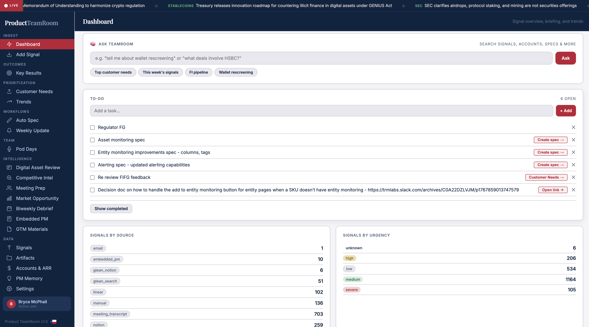
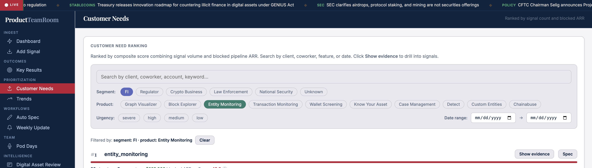
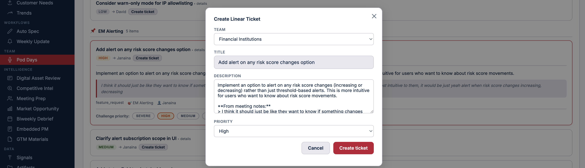
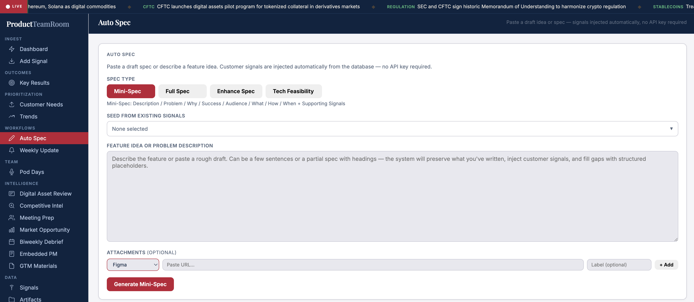
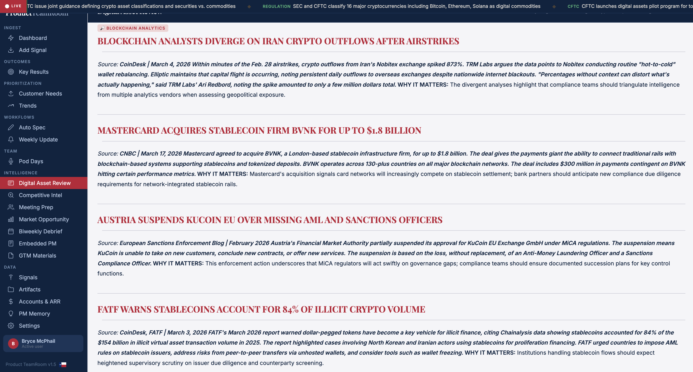
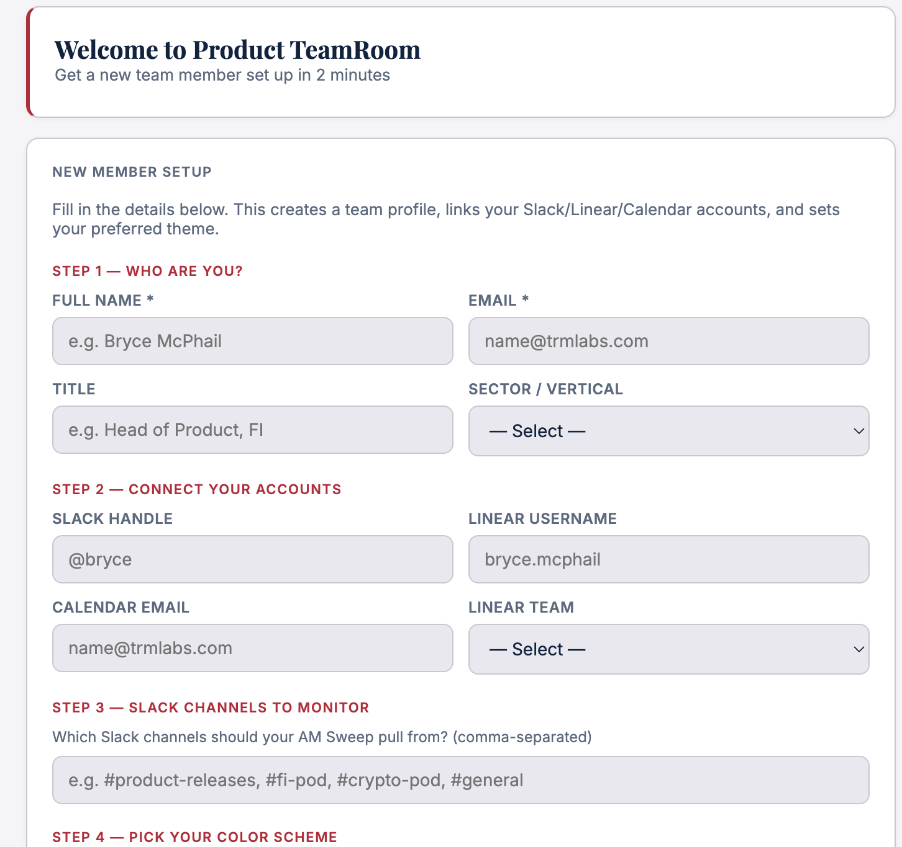

# TeamRoom

A PM operating system for running teams and shipping work

Ever since I began my career in product management, I had a tool in mind that I wish existed.

Much of a product manager's job is to synthesize. You are expected to understand several disparate sources of information across different people, across different verticals, and find themes. Signal in the noise. Prioritization. ARR. Then take all of those disparate inputs and turn them into a single pipeline or roadmap of the most valuable things to build.

The problem is there has never been a system designed for this. There is no system of record for product signal.

For years, signal has lived everywhere and nowhere at the same time. Gong for sales calls. UserVoice for feature requests. Slack for company communication. Email for personal communication. Google Drive for meeting transcripts. Manual notes that live in isolation. All of it matters, but none of it is unified.

There has never been a single tool that brings all of this together in an organized way, and more importantly, not in a way that is actionable or gives you intelligence before you even go looking for it.

So I built one.

*The TeamRoom dashboard - signal overview, tasks, and briefing in one place.*

A tool that acts as a second brain for a product manager. A system that allows me to understand every piece of signal, what client it is tied to, how much ARR that client is generating, and prioritize based on both volume of requests and revenue impact. But ingesting and organizing signal is not enough. The real goal is to act on it from the same place, to move from signal to decision to execution without friction.

That is what TeamRoom is. An operating system for product management.

I am not an engineer by trade. Everything I built here was done using tools like Claude, Cowork, and ChatGPT. That is new. The ability to take a problem you understand deeply and actually build the system to solve it yourself - without waiting on engineering, without writing production code - is a shift. It means the people closest to the problem can now build the solution. That is the real unlock.

None of this would exist without TRM Labs. TRM is not a company that quietly tolerates AI tools or cautiously approves of them. It is a company that pushes you toward them. You are not measured against what the rest of the market can do. You are measured against what you are capable of becoming. That is the culture that made this possible.

TeamRoom is built around a few core functions.

The first is ingest. This is where signal enters the system. I can manually add signal, or rely on a dashboard that continuously updates. Every time I log in, I see all signals that have come in, where they came from, what they are telling me, and which clients are driving the most activity. Instead of hunting for information, it is brought to me already structured.

Next is prioritization. This is where signal becomes clear. Customer needs are aggregated, trends emerge, and patterns that were previously buried become obvious. Instead of reacting to the loudest voice, I can act on what is consistently showing up across customers, tied directly to ARR.

*Customer needs ranked by composite score - signal volume combined with blocked pipeline ARR.*

Then there is team flow. At my company, we run weekly demo and testing sessions with internal SMEs. Multiple meetings happen in parallel across different products, rooms, and groups. It is noisy and fragmented. So we transcribe everything. Those transcripts go into TeamRoom and get processed all at once. What comes out is structured output per demo: what feedback we received, what is urgent, high, medium, and low. Each item includes a description, editable fields, and the ability to create a ticket in Linear in one click. What used to require hours of synthesis is now immediate. From noise to action in one pass.

*From demo feedback to a Linear ticket in one click - team, title, description, and priority already populated.*

Then there is AutoSpec. It allows me to generate a product spec from a voice note, a blurb, or directly from signal already in the system, and it can enhance an existing spec using the accumulated signal database, which is continuously evolving. I can seed from existing signals tied to a product or topic, describe a feature or problem, attach Figma or other resources, and generate a spec in one step. This collapses the gap between insight and execution.

*AutoSpec - customer signals injected automatically, no API key required.*

Then there is intelligence. This is the layer that keeps me aware of the market. A daily briefing pulls from the sources I care about - regulatory news, competitive movements, market developments - and delivers it already structured. Instead of searching for context, context is delivered.

*The intelligence layer - curated market briefing with source attribution and why-it-matters analysis.*

There is one layer I did not expect going into this.

I have set up agents that continuously test TeamRoom itself. Not one-off scripts. Not manual QA passes. They run on a loop, constantly interacting with the product, looking for regressions, validating that core workflows still behave the way they should.

Two types of testing run in parallel. One focused on functional behavior - whether the system is doing what it is supposed to do. The other focused on how the system behaves across real workflows, closer to how an actual user would experience it. When issues are found, separate agents handle the fix. If a bug is low risk, it gets resolved automatically. If it could have broader implications, I get pulled in before anything changes.

What this creates is a system that does not just get built once and maintained manually. It continuously tests and improves itself. My role shifts from constantly checking and reacting to supervising and guiding. I am not the bottleneck for quality anymore. I set the guardrails and let the system operate within them.

The system is not just helping me build product. It is helping me maintain it.

TeamRoom is not just a product tool. It is a pattern. The goal is not a single TeamRoom. The goal is many. A product TeamRoom, a marketing TeamRoom, a sales TeamRoom. Each one built around the same idea: ingest signal, structure it, tie it to outcomes, and turn it into action. Once you understand how to build one, you can build an operating system for any function.

This tool has made my life significantly easier. But more than that, it has changed how I operate.

TeamRoom is built to take fragmented information and turn it into structured signal, tie that signal to customers and revenue, convert it into decisions and product specs without friction, and move from awareness to action as fast as possible.

*Getting started takes two minutes - connect your tools, configure your channels, and the system begins pulling signal immediately.*

It is a second brain. But more than that, it is an operating system for product.

And once you have it, it is very hard to go back.

There is one more thing worth saying.

I came to TRM Labs because I wanted to be at the cutting edge of what is possible in product development. Outside of the mission - making the world a safer place, which is genuinely true and not just a line - and the quality of the people I get to work with every day, my favorite thing about TRM is the relationship to AI. You are not just allowed to build these things. You are not just encouraged. You are pushed.

TRM measures you against what is possible, not what is typical. If that is the kind of environment you want to work in, I would seriously encourage you to consider a career at TRM.
